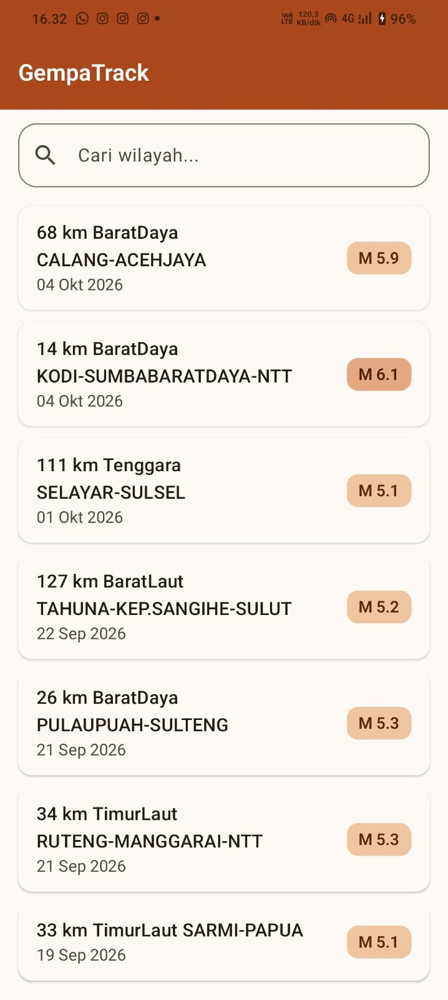
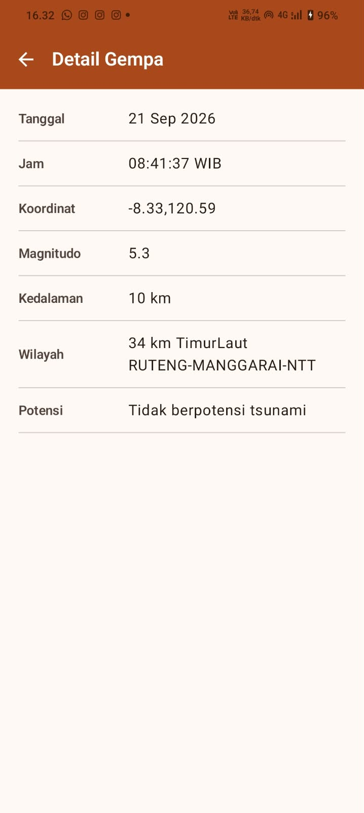

# 🌊 GempaTrack

Aplikasi Android **katalog dan monitoring gempa terkini BMKG** — dibangun dengan **Kotlin + Jetpack Compose (Material 3)**, arsitektur **MVVM**, data dari REST API BMKG secara dinamis.

Dibuat untuk tugas **Responsi Mobile I — Paket 1: Aplikasi Katalog dan Monitoring Gempa BMKG**.

## ✨ Fitur

| Fitur | Keterangan |
|---|---|
| 📋 **Daftar Gempa Terkini** | Menampilkan 15 gempa terakhir dari API BMKG via `LazyColumn` — Tanggal, Magnitudo, Wilayah (tanpa gambar) |
| 🔍 **Pencarian Wilayah** | Search bar filter lokal (in-memory) berdasarkan nama wilayah, case-insensitive, tanpa request tambahan |
| 📄 **Detail Gempa** | Klik item → halaman detail: Tanggal, Jam, Koordinat, Magnitudo, Kedalaman, Wilayah, Potensi |
| 🔄 **Loading & Error State** | Indikator loading saat fetch; pesan error + tombol "Coba Lagi" saat jaringan bermasalah |
| 🎨 **Material Design 3** | Tema light/dark + custom typography, palet oranye lembut (burnt orange) nyaman dilihat |
| 🧭 **Navigasi 2 Screen** | Home ⇄ Detail via `navigation-compose`, tombol back berfungsi |

## 📱 Screenshot

| Home Screen | Detail Screen |
|---|---|
|  |  |

*Screenshot diambil dari emulator (Medium Phone API 36.1) saat app berjalan dengan data API BMKG asli.*

## 🏗️ Arsitektur

**MVVM (Model-View-ViewModel) + Repository**, state-driven UI via `StateFlow`:

```
┌─────────────────────────────────────────────────────┐
│  View (Composable)                                  │
│  HomeScreen / DetailScreen                          │
│  └── collect StateFlow (collectAsState)             │
├─────────────────────────────────────────────────────┤
│  ViewModel (HomeViewModel)                          │
│  └── UiState: Loading / Success / Error             │
│  └── searchQuery + filteredGempa (filter lokal)     │
├─────────────────────────────────────────────────────┤
│  Repository (GempaRepository)                       │
│  └── bungkus hasil API jadi Result / UiState        │
├─────────────────────────────────────────────────────┤
│  Remote (Retrofit + Gson)                           │
│  ApiService → RetrofitClient → data.bmkg.go.id      │
├─────────────────────────────────────────────────────┤
│  Data Model (GempaResponse / Gempa)                 │
└─────────────────────────────────────────────────────┘
```

### Alur data

1. `HomeViewModel` memanggil `GempaRepository.getGempaterkini()` saat pertama kali dibuka.
2. Repository memanggil `ApiService` (Retrofit) → server BMKG.
3. Hasil dibungkus **`UiState`** (sealed): `Loading` → `Success(data)` / `Error(message)`.
4. Composable `HomeScreen` mengumpulkan `StateFlow` lewat `collectAsState()` dan merender sesuai state.
5. Pencarian = filter lokal di ViewModel (`combine`) — tidak ada request jaringan tambahan.

### Sealed UiState

```kotlin
sealed interface UiState<out T> {
    data object Loading : UiState<Nothing>
    data class Success<T>(val data: T) : UiState<T>
    data class Error(val message: String) : UiState<Nothing>
}
```

### Struktur proyek

```
app/src/main/java/com/gempatrack/app/
├── MainActivity.kt
├── data/
│   ├── remote/
│   │   ├── ApiService.kt            // @GET gempaterkini.json
│   │   ├── RetrofitClient.kt        // base URL + Gson converter
│   │   └── model/Gempa.kt           // GempaResponse, Infogempa, Gempa
│   └── repository/
│       └── GempaRepository.kt       // pemanggil API satu-satunya
└── ui/
    ├── theme/
    │   ├── Color.kt                 // palet oranye lembut (burnt orange)
    │   ├── Theme.kt                 // Light/Dark ColorScheme
    │   └── Type.kt                  // custom typography (7 override)
    ├── state/UiState.kt             // sealed Loading/Success/Error
    ├── navigation/GempaTrackNavGraph.kt  // navigation-compose 2 route
    ├── home/
    │   ├── HomeScreen.kt            // Scaffold + TopAppBar + LazyColumn
    │   └── HomeViewModel.kt         // StateFlow + filter pencarian
    └── detail/
        └── DetailScreen.kt          // 7 field + tombol back
```

## 🌐 API

**Sumber data:** REST API BMKG — tanpa API key.

| Item | Nilai |
|---|---|
| Base URL | `https://data.bmkg.go.id/` |
| Endpoint | `DataMKG/TEWS/gempaterkini.json` |
| URL lengkap | `https://data.bmkg.go.id/DataMKG/TEWS/gempaterkini.json` |
| Metode | `GET` |

**Struktur respons:**

```json
{
  "Infogempa": {
    "gempa": [
      {
        "Tanggal": "18 Sep 2026",
        "Jam": "21:36:17 WIB",
        "DateTime": "2026-09-18T14:36:17+00:00",
        "Coordinates": "-8.64,105.74",
        "Lintang": "8.64 LS",
        "Bujur": "105.74 BT",
        "Magnitude": "5.2",
        "Kedalaman": "10 km",
        "Wilayah": "198 km BaratDaya BAYAH-BANTEN",
        "Potensi": "Tidak berpotensi tsunami"
      }
    ]
  }
}
```

> **Catatan teknis:** seluruh nilai dari BMKG bertipe **String** (termasuk `Magnitude`). Parsing numerik memakai `magnitudeValue` (`toDoubleOrNull()`) di data class. Semua field nullable → null safety Kotlin terpenuhi.

## 💻 Teknis

### Teknologi

- **Kotlin** — data class, null safety, StateFlow, extension
- **Jetpack Compose** — composable, LazyColumn, Material 3, Scaffold + TopAppBar
- **Retrofit 2 + converter-gson** — networking
- **navigation-compose** — 2 screen
- **lifecycle-viewmodel-compose** — ViewModel + UI state

**Library yang diizinkan saja** (sesuai aturan tugas): `retrofit`, `converter-gson`, `navigation-compose`, `lifecycle-viewmodel-compose`. **Tanpa** Coil/Glide/library gambar — daftar gempa dipastikan tidak memuat gambar.

### Build

```bash
# dari folder proyek
./gradlew assembleDebug
```

APK hasil: `app/build/outputs/apk/debug/app-debug.apk`

### Install ke device

```bash
adb install -r app/build/outputs/apk/debug/app-debug.apk
```

### Syarat sistem

| Item | Nilai |
|---|---|
| minSdk | 24 (Android 7.0) |
| targetSdk | 37 |
| compileSdk | 37 |
| Internet | `android.permission.INTERNET` di AndroidManifest.xml |

## 🔄 Persyaratan Tugas (checklist)

- [x] Kotlin: data class, null safety, lambda
- [x] Jetpack Compose + LazyColumn + reusabel composable
- [x] Material Design 3 — modifikasi `Color.kt`, `Theme.kt` (Light/Dark ColorScheme), `Type.kt` (7 override)
- [x] Scaffold + TopAppBar
- [x] Data dari API BMKG (tanpa gambar)
- [x] Search bar (filter lokal wilayah)
- [x] Loading state + Error state + retry
- [x] MVVM: View / ViewModel / Repository / ApiService / Data Model / sealed UiState / StateFlow
- [x] Retrofit + converter-gson
- [x] INTERNET permission
- [x] Maks 2 screen (navigation-compose)

## 📦 Deliverable

- Source code lengkap di repository ini
- APK debug: `app-debug.apk` (dari `assembleDebug`)
- Video penjelasan kode (fokus kode, bukan demo)

---

Dibuat dengan ❤️ untuk Responsi Mobile I — Paket 1. 🌊